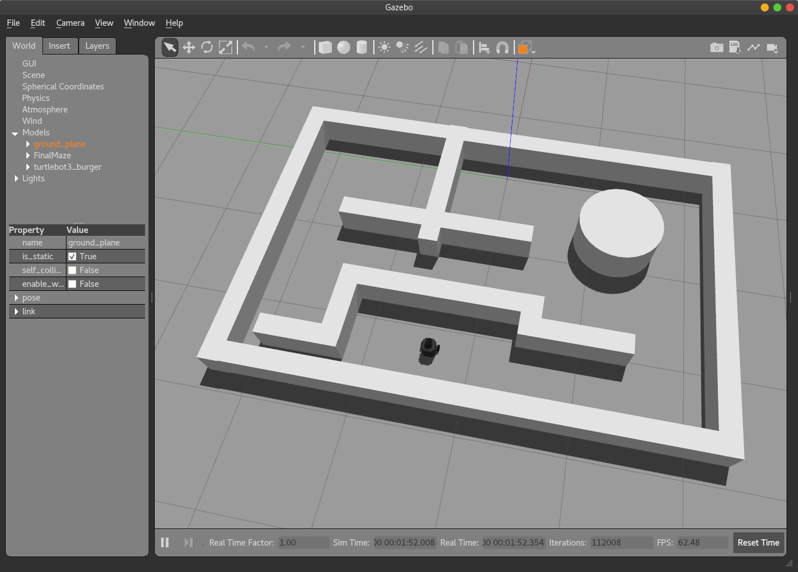
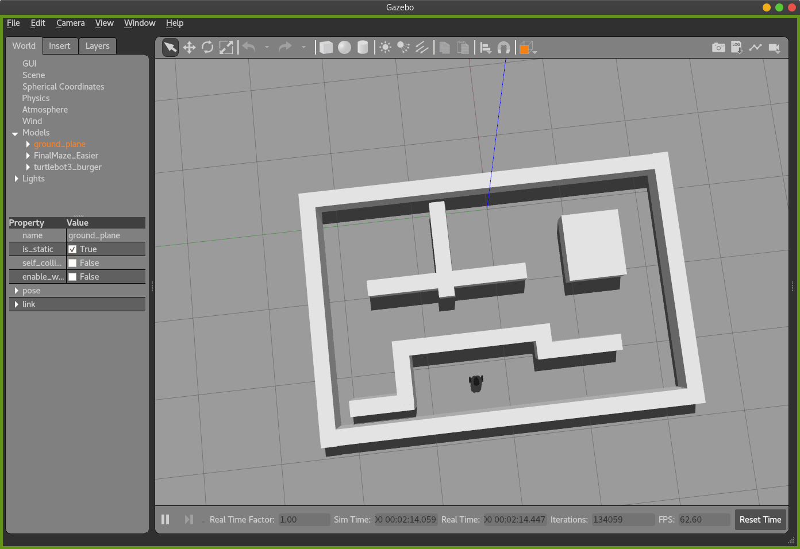

# RBE 3002 Final Demo

## Launching the Final Demo
1. Clone this repository in your catkin workspace:

``` bash
git clone https://github.com/RBE300X-Lab/RBE3002_Final.git
```

2. You should be launching the `turtlebot3_world.launch` file in your own launch file. This launch file has an argument built in called `world_name` that allows you to change the world your robot spawns in to. In order to change it, add these arguments to your launch file under the `include` statement where you launch the `turtlebot3_world.launch`. It is important you don't change the values of the robot position.
```xml
<arg name="world_name" value="$(find rbe3002_final)/worlds/final_maze.world"/>
<arg name="x_pos" value="-2.2"/>
<arg name="y_pos" value="0.4"/>
<arg name="z_pos" value="0.05"/>
```
3. Add the following line to your launch file before you launch Gazebo:
``` xml
<env name="GAZEBO_MODEL_PATH" value="$(find rbe3002_final)/models:$(optenv GAZEBO_MODEL_PATH"/>
```

Your final launch file should look something like this, with your added nodes and launch files. You can also find a sample launch file under `*/launch/sample.launch`
``` xml
<launch>
    <env name="GAZEBO_MODEL_PATH" value="$(find rbe3002_final)/models:$(optenv GAZEBO_MODEL_PATH"/>
    <include file="$(find rbe3002-turtlebot)/launch/turtlebot3002_world.launch">
        <arg name="world_name" value="$(find rbe3002_final)/worlds/final_maze.world"/>
        <arg name="x_pos" value="-2.2"/>
        <arg name="y_pos" value="0.4"/>
        <arg name="z_pos" value="0.05"/>
    </include>
</launch>
```

## Final Maze World Screenshot


## Final Maze Easier World Screenshot
